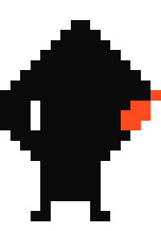

# Gagandeep Singh

  <picture>
    <source media="(prefers-color-scheme: dark)" srcset="assets/eagle-dark.svg">
    
  </picture>

<i>I stopped writing code and started writing constraints.</i> 
<i>Then I gave the code to a team of AI agents and kept the judgment.</i> 
<i>The moat isn't the tool — it's the process around it: AI handles volume and speed; the process handles correctness;</i> 
<i>I handle product decisions and everything the AI isn't allowed to decide alone.</i> 
<i>One person shipping at team pace, provided the gates hold.</i>

<b><a href="https://portfolio-gagan-53.netlify.app">portfolio-gagan-53.netlify.app →</a></b>

---

## Now

**AI Builder @ [Cuemath](https://cuemath.com)** — I design, ship, and operate the production platform behind internal operations, end to end. Next.js + Postgres, plus the analytics layer that shapes strategy upstream.

**Agentic AI engineering** — teams of Claude Code agents under sprint plans and review gates; large builds run ~20 agents with a master orchestrator and explicit file ownership. The method: [portfolio → studio](https://portfolio-gagan-53.netlify.app/studio).

**Data-driven insights** — funnels formalized as state machines, drop-off root-cause analysis, source attribution. Every analysis lands as a decision brief: finding, recommendation, counterfactual.

**Available for conversations** — Claude Code workflows · agentic AI development · production ML systems. Email [gagan08deepsingh@gmail.com](mailto:gagan08deepsingh@gmail.com) · DM [@gagan-53](https://github.com/gagan-53).

---

## Open Source

<table>
<tr>
<td width="50%" valign="top">

### [portfolio](https://portfolio-gagan-53.netlify.app) · [live](https://portfolio-gagan-53.netlify.app)

Dusk-terminal portfolio — scroll dives into the monitor; the whole site lives inside the screen.

 

</td>
<td width="50%" valign="top">

### [spend-tracker](https://spend-tracker-gd.netlify.app) · [live](https://spend-tracker-gd.netlify.app)

Telegram-native personal finance dashboard with a weekly Claude Haiku digest.

 

</td>
</tr>
<tr>
<td width="50%" valign="top">

### [kortex](https://github.com/gagan-53/kortex) · [live](https://kortex-gd.netlify.app)

PDF → AI flashcards with spaced repetition — SM-2 scheduling on Neon Postgres, serverless on Netlify.

 

 

</td>
<td width="50%" valign="top">

### [self-healing-ml-pipeline](https://github.com/gagan-53/self-healing-ml-pipeline)

Autonomous fault detection, RCA, and recovery for ML workflows. IEEE-format paper.

 

 

</td>
</tr>
<tr>
<td width="50%" valign="top">

### [plant-disease-webapp](https://github.com/gagan-53/plant-disease-webapp)

Custom CNN plant-disease diagnosis from leaf photos · 95% test accuracy on PlantVillage.

 

 

</td>
<td width="50%" valign="top">

### [model-shift-mvp](https://github.com/gagan-53/model-shift-mvp)

Native macOS 13+ utility packaged via Swift Package Manager.

 

 

</td>
</tr>
</table>

---

## How I build — 4 gates

Every change flows through this. A `git-guard` hook makes touching `main` directly impossible — even for the AI.

<table>
<tr>
<td width="25%" valign="top" align="center">

**01 · Fact-forcing**

Agent must state what a command verifies, confirm no existing file serves the purpose, and quote instructions verbatim.

</td>
<td width="25%" valign="top" align="center">

**02 · Devil's advocate**

Adversarial reviewer interrogates every plan against the real codebase before I approve it.

</td>
<td width="25%" valign="top" align="center">

**03 · Four-reviewer**

Specialized TypeScript, React, database, and security review agents must all pass.

</td>
<td width="25%" valign="top" align="center">

**04 · Clarify, never assume**

Open PRD questions are hard build gates. Agents ask, not guess.

</td>
</tr>
</table>

---

## Highlights

| Highlight | Detail |
|---|---|
| **AI Builder @ Cuemath** | Own the production platform behind internal operations end to end (Next.js + Postgres) + the funnel analytics that shape strategy. |
| **Agentic AI, daily driver** | Multi-agent Claude Code build teams, sprint-planned, with 4 hard review gates. Every project on the portfolio — including the portfolio — shipped this way. |
| **Data + Insights** | Funnel state modeling · drop-off RCA · source attribution · retention cohorts · decision briefs. |
| **Anthropic Certified** | Claude 101 + AI Fluency (2026). Applied daily. |
| **Oracle GenAI Certified** | OCI Generative AI Professional (2024). |
| **Chandigarh University** | BE, Computer Science · 2022 – 2026 · CGPA 8.19 / 10. |

---

## Stack

- **Languages** — Python · TypeScript · JavaScript · Swift · SQL · C++
- **Frameworks** — Next.js 14 · React · Flask · Tailwind · Prisma
- **Data** — PostgreSQL (Neon, Supabase) · SQLite
- **ML / AI** — TensorFlow · PyTorch · Anthropic Claude · Google Gemini
- **Agentic AI** *(daily driver)* — Claude Code · multi-agent orchestration · MCP · prompt caching · prompt evals
- **Analytics** — funnel state modeling · drop-off RCA · source attribution · Pareto
- **Ops** — GitHub Actions · Netlify · Docker · Playwright E2E

---

  
  

---

<a href="https://portfolio-gagan-53.netlify.app"><b>Portfolio</b></a>
&nbsp;·&nbsp;
<a href="https://linkedin.com/in/gagan08deepsingh">LinkedIn</a>
&nbsp;·&nbsp;
<a href="mailto:gagan08deepsingh@gmail.com">Email</a>
&nbsp;·&nbsp;
Chandigarh & Gurugram · IST

